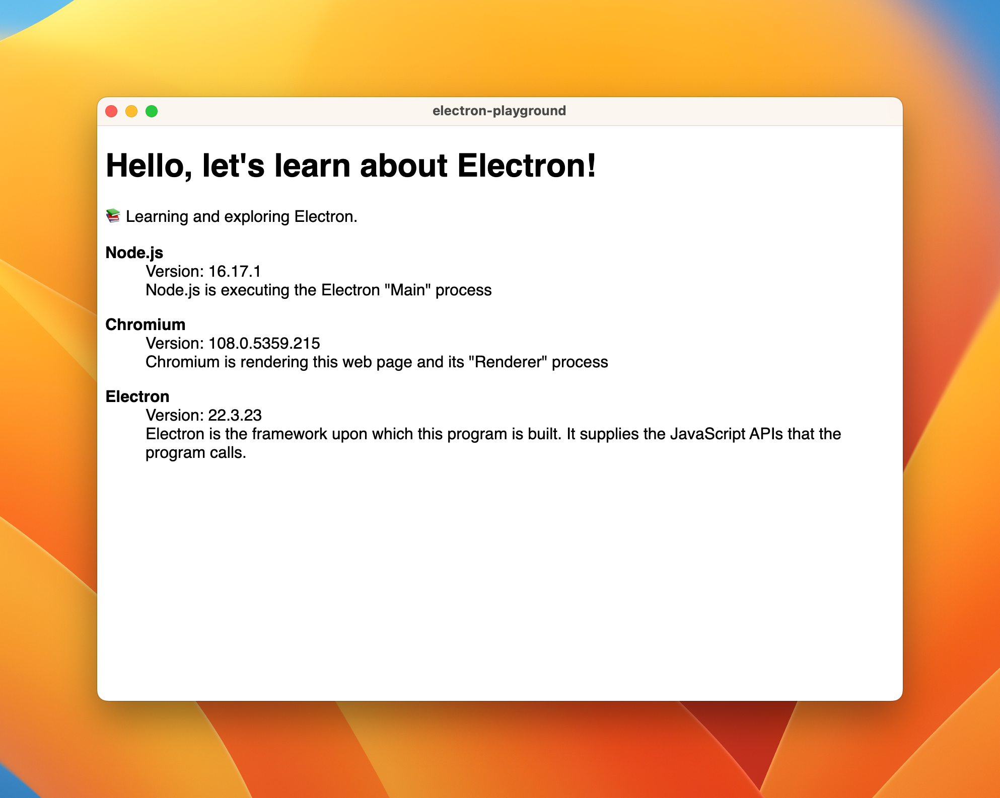

# electron-playground

📚 Learning and exploring Electron.

> Build cross-platform desktop apps with JavaScript, HTML, and CSS
>
> -- <cite>https://www.electronjs.org</cite>

## Description

This is a simple Electron app I use as a working example for my own reference. It is adapted from the official Electron
quick-start app <https://github.com/electron/electron-quick-start>.

## Instructions

Follow these instructions to build and run the app.

1. Use Node v17
2. Install dependencies:
   * `npm install`
3. Run the app:
   * `npm start`
   * Success! It should look something like this:
     

## Wish List

General clean ups, TODOs and things I wish to implement for this project:

* DONE How does the "preload" lifecycle work exactly? How does ipc work? How do Web Workers work? I'd like to try injecting
  the version data using one of these methods instead of what I'm doing in the `detect-versions.js` script.  
* DONE Send a message from the mainProcess to the renderer process

## Reference

* [Electron official site: Tutorial on "Context Isolation"](https://www.electronjs.org/docs/tutorial/context-isolation)
* [StackOverflow answer about "preload" scripts](https://stackoverflow.com/a/59814127)
* [Electron official site: API for "BrowserWindow"](https://www.electronjs.org/docs/api/browser-window)
* [Electron official site: API for "webContents" and sending messages](https://www.electronjs.org/docs/api/web-contents#contentssendchannel-args)
