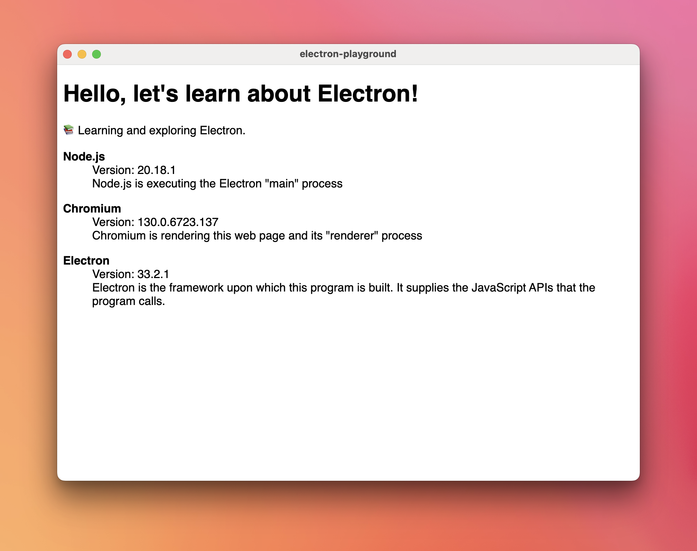

# core-only

A simple Electron app that showcases core APIs and nothing else.


## Overview

This is a simple Electron app I use as a working example for my own reference about core Electron APIs and concepts. For
example, it showcases the concepts of the *main* process, a *renderer* process and a *preload script*. By contrast,
it does not feature incidental complexity like a TypeScript compilation step, a bundle step, or even testing. These things
are important for a production codebase, but this is a learning-style codebase. It is adapted from the official Electron
quick-start app <https://github.com/electron/electron-quick-start>.


## Instructions

Follow these instructions to build and run the app.

1. Pre-requisite: Node.js
   * I used Node v20
2. Install dependencies:
   * ```shell
     npm install
     ```
3. Run the app:
   * ```shell
     npm start
     ```
   * Success! It should look something like this:

     


## Wish List

General clean-ups, TODOs and things I wish to implement for this project:

* [x] DONE How does the "preload" lifecycle work exactly? How does ipc work? How do Web Workers work? I'd like to try injecting
  the version data using one of these methods instead of what I'm doing in the `detect-versions.js` script.  
* [x] DONE Send a message from the mainProcess to the renderer process
* [x] DONE Upgrades and fix for failing preload script (Electron 20 change I think)
* [x] DONE Revisit the `nodeIntegration: true` configuration. I needed this after migrating from Electron 18 to 22 because
  ["sandbox mode" is enabled by default starting in 20](https://www.electronjs.org/docs/latest/tutorial/sandbox). I'm not
  sure if I really need "node integration" or if I can get away with sandbox mode disabled, or even better yet, there is
  a more secure/idiomatic way to detect environment/platform versions like Node/Chromium/Electron and pass these values
  to the frontend (I bet there is).
* [x] DONE Turn this into a multi-project repository. Turn the existing example into a "barebones" subproject because it is
  a good example of the foundational/core APIs of Electron and does not contain much incidental complexity like a
  build/bundle step or even downloading any dependencies (nice!)
* [ ] (Consider waiting a long while before doing this. Even the Electron docs are still using CommonJS). Upgrade to ESM instead of CommonJS once Electron 28 is released (this long-awaited feature was implemented in 28
  is available in beta).
* [x] IN PROGRESS (Answer: everything is available by default) How does Electron serve content to the webpage? Does it just serve everything under the "path" directory that it
  was invoked with? Can you reference files outside this directory with something like `../secret-file.txt`? The `--help`
  docs on the `electron` command are sparse and I don't see anything obvious in the Electron docs. This is something I've
  [explored before](https://github.com/dgroomes/electron-playground/commit/b34aa11329e6178d7d781e06bd8339fffc36d01b#diff-8f2e8f513699eefdf6bc04ce722de524671ac8a7a90c07a8e2cf199d51183043R50)
  but even at the time I didn't grok it.


## Reference

* [Electron official site: Tutorial on "Context Isolation"](https://www.electronjs.org/docs/tutorial/context-isolation)
* [StackOverflow answer about "preload" scripts](https://stackoverflow.com/a/59814127)
* [Electron official site: API for "BrowserWindow"](https://www.electronjs.org/docs/api/browser-window)
* [Electron official site: API for "webContents" and sending messages](https://www.electronjs.org/docs/api/web-contents#contentssendchannel-args)
